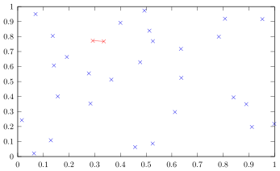

# algodat 04

Task:  Implement an algorithm for finding the closest pair of points.

The following example shows 30 randomly generated points.
The closest pair of points among these has been highlighted in red and
connected with a line.



## building
```sh
mkdir build
cd build
cmake ..
make
```

Executables will be in `build/source`.

## tests
From the `build` directory, run `source/tests` to run the unit tests.

## example program
From the `build` directory, run `source/example` to see full output.

You can optionally specify the number of points generated.

```sh
[jakob@argon build]$ source/example 5
# gnuplot script
unset key
set term png
set output 'plot.png'
plot '-', '-' w l
0.840188 0.394383
0.783099 0.79844
0.911647 0.197551
0.335223 0.76823
0.277775 0.55397
e
0.840188 0.394383
0.911647 0.197551
e
# Closest points (naive): (0.840188, 0.394383) (0.911647, 0.197551) (d=0.209402)
# Closest points (di&co): (0.840188, 0.394383) (0.911647, 0.197551) (d=0.209402)
```

The output prints all points as well as the closest pair.
It also functions as a [gnuplot](http://www.gnuplot.info/) script.

To get a simple plot run the following:
```sh
[jakob@argon build]$ source/example 13 > script.gnuplot
[jakob@argon build]$ gnuplot -c script.gnuplot
```

This plots the data to `plot.png`:


